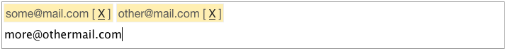

Extension for the Yii Framework: Bulk Mail Widget
=================================================

Yii Extension: Bulk Mail List Widget

#What it does?

It is a GUI control which provides functionality for handling a list of emails. The user can also input new email adresses or even complete texts where email address are beeing extracted. similar to this is the nowadays email adress receipe input in GMail or YMail. The entries can also be edited by the user. *A big advantage*: the user can copy *ANY* text he wants inside the input field and the widget extracts every mail adresse contained in the text.

#Screenshot

#Install

Extract the [downloaded ZIP](https://github.com/mrqc/yiibulkmailwidget/archive/master.zip) and copy the folder “BulkMail” into “protected/extensions”

#Usage example

    <?php /* the surrounding form */ $form = $this->beginWidget(‘CActiveForm’, …. ?>

    <?php
        //this is the actual code to call the widget
        $this->widget(‘application.extensions.BulkMail.BulkMail’,
            array(
                ‘model’ => $model,
                ‘field’ => ‘emails’,
                ‘form’ => $form
            )
        );
    ?>

#Parameters

Mandatory parameters:

    $model: the model where the data is stored and comes from
    $field: the name of the field where the data is stored and comes from inside the model
    $form: the form object where the widget is embedded

Optional parameters:

    $regEx: (default: “/([a-zA-Z0-9._-]+@[a-zA-Z0-9._-]+\.[a-zA-Z0-9._-]+)/gi”) for the detection of emails within the string the user puts in – must be a javascript regex
    $cssEntry: (default “background-color: #FFEFB2; border: 1px solid #EEEEEE; display: inline-block; padding: 2px; margin: 2px;”) the css for one entry of an email adress
    $cssInputNew: (default: “border: 0px solid; width: 98%; padding: 2px; font-size: 16px;”) the css for the text input field where the user can input new emails
    $cssEditInputField: (default: “”) the css for the edit input field
    $cssContainer: (default: “border: 1px solid #9b9b9b;”) the css for the overall div where everything is placed

#More Info and Contact

[master-studios.net](http://www.master-studios.net/softare-web-development/open-source/yii-bulkmail-e-mail-address-list-widget)
